## Bitcoin
### (mainly some thoughts and notes)

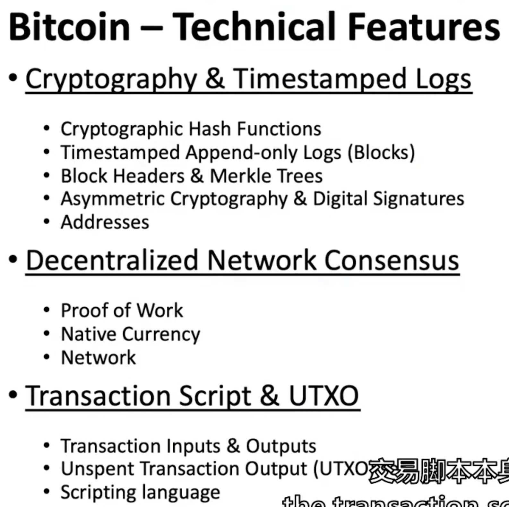

### 1. 
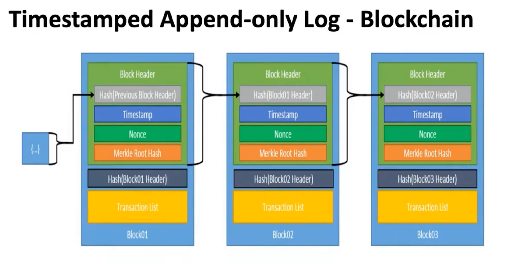

### 2. 
 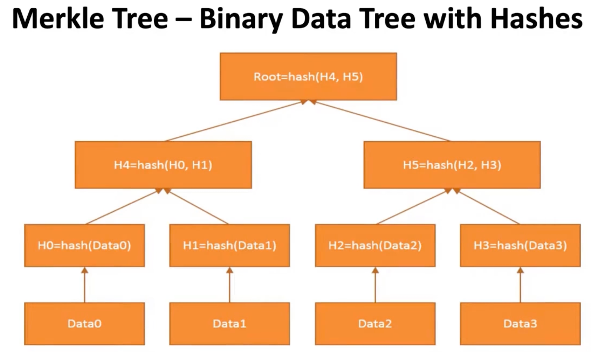

### 3. 电子签名
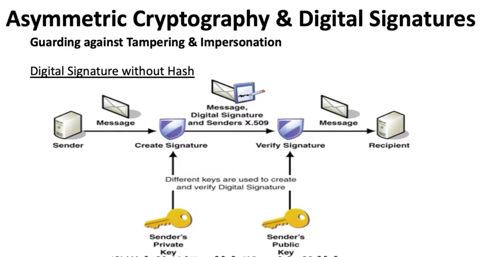
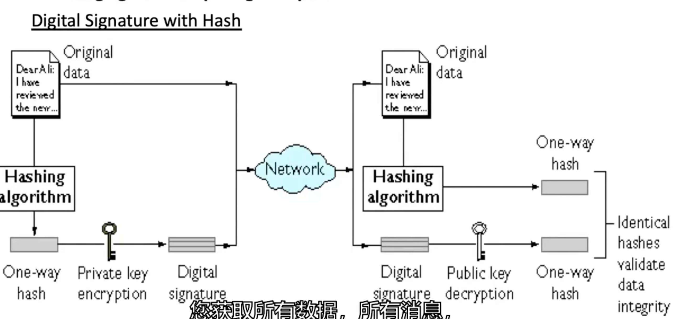

### 4. bitcoin address
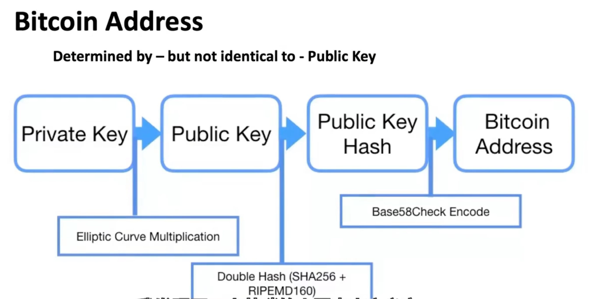

### 5. Proof of work
proof of work 是对拜占庭将军问题的一种解法，其问题描述的是如果在一个去中心化的分布情况，达成共识，使得问题得以解决且不被坏人操控
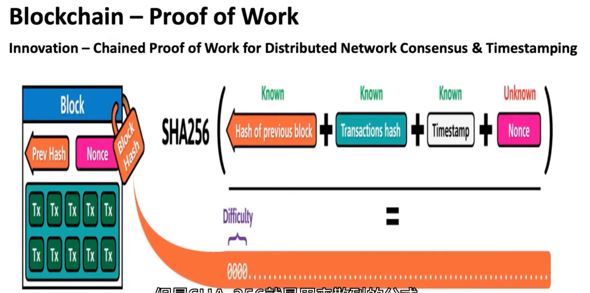
其实就是解题，获得一定范围的哈希值，Nonce就是你的答案，有答案证明你mine过了，并且通过一整条的信息和答案链的交错，使得一旦你尝试篡改什么东西，很多东西都会报错

- Satoshi Nakamoto控制十分钟出一区块，他是有一个difficulty adjustment的机制

- 从经济角度出发，2010年推出了矿池，共享算力，共享奖励，还有矿池运营商统一调度，收取一些费用

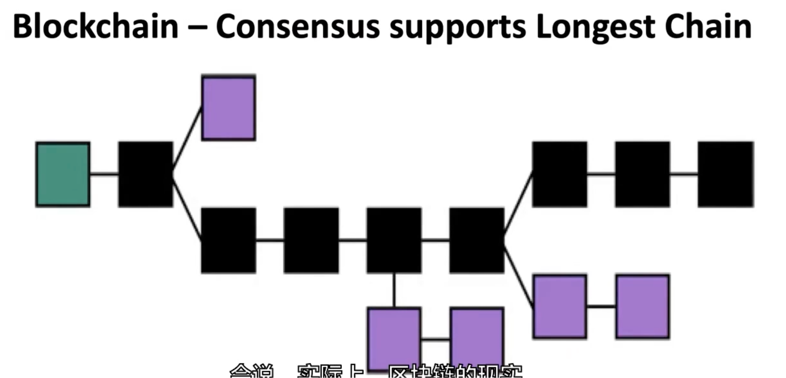
紫色的是orphan blocks
在比特币里产生orphan blocks大部分是正常情况
- 有个要注意的点，在orphan blocks里挖出区块，也会有coinbase产生，但是记录在stale block里，一旦被定为废链，那么产生的coinbase就无效了
>如由于“巧合”同时撞线： 有时候，位于中国的矿工 A 和位于美国的矿工 B，在几乎同一秒算出了正确答案（挖出了一个新的区块）。
>网络传播需要时间（Latency）：
>矿工 A 把他的区块广播出去，亚洲的节点先收到了，认为 A 是最新的。
>矿工 B 把他的区块广播出去，美洲的节点先收到了，认为 B 是最新的。
>此时，区块链在全网短暂地分叉成了两个版本（Fork）。
>最长链原则（决胜负）： 网络不能一直分叉。接下来，如果矿工 C 在 A 的基础上挖出了下一个区块，A 的链就变得更长了。
>根据比特币的“最长链原则”（Longest Chain Rule），全网会承认 A 的链是主链。
>结果： 矿工 B 那个合法的、辛苦算出来的区块，因为“运气不好”没能延续下去，就被抛弃了。这个被抛弃的区块就是 Orphan Block（在技术上也常被称为 Stale Block，陈旧块）。

- 比特币中的分叉有两种
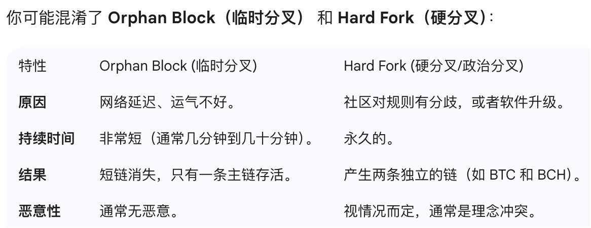

### 6.Network(整个网络里的组成部分)
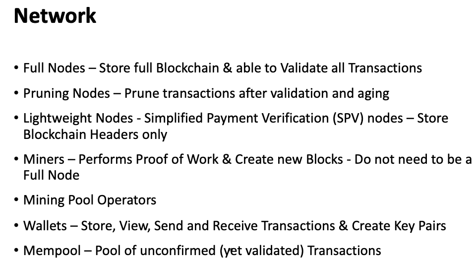

### 7.Transaction
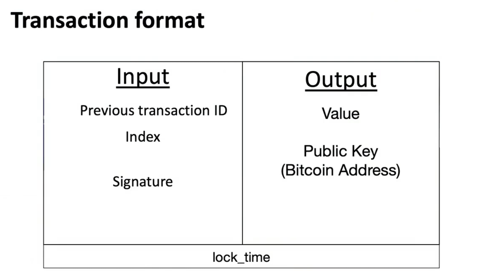
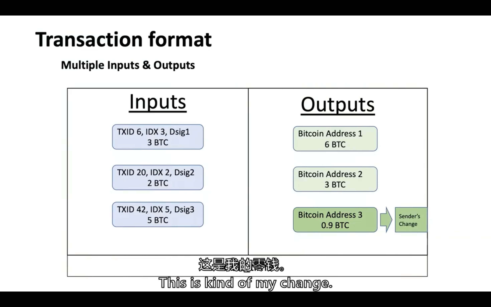
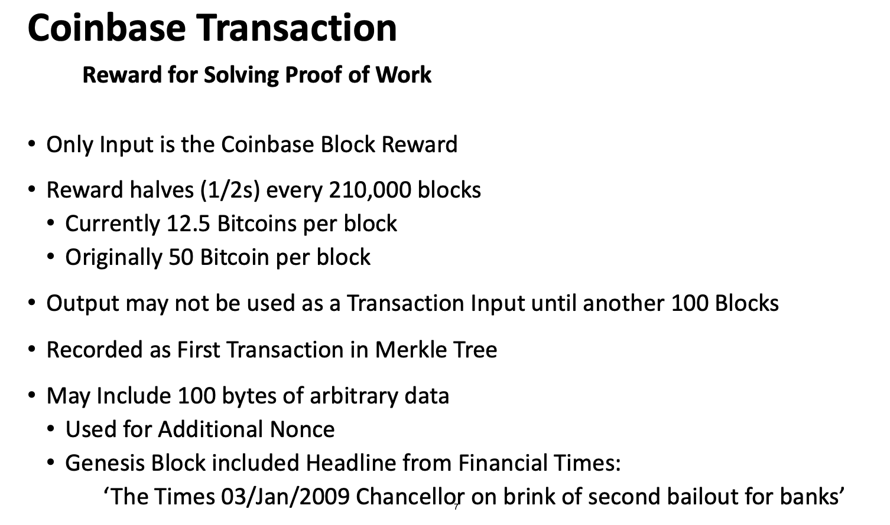
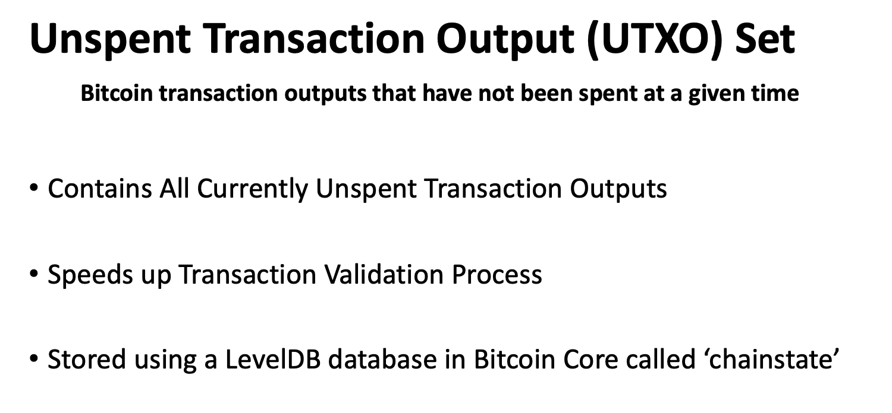
**1.UTXO就是代码层面的比特币，你的账户里不会像balance model一样显示有多少余额，只会有几串UTXO代码，交易的时候，会把这些UTXO拿出来销毁变成STXO（Spent Transcation Output），然后付钱和找零，相当于是支票的核销防止双花，同时留下手续费作为激励**

**2.所有的UTXO被存在一个chainstate的键值对数据库里，交易的时候会去根据交易的哈希值去查询有没有这么一个UTXO进行验证，所以知道一个账户的余额是比较困难的，钱包软件是扫描整个数据库把属于你的加总起来，但是实际交易其实只是会验证你有没有资格交易，一些节点包含有完整的chainstate数据库** 

### 1. digital signature system

### 2. incentive(rewanrd)
1. 如果你有作弊修改ledger的算力，那么你会发现按照Satoshi制定的规则，你能获得更多的利益

### 3. proof of work

### 4. difficulty ajustment

### 5.full nodes
Bitcoin full nodes are operating computers that observe and validate the Bitcoin blockchain, but do not generally mine new blocks.They serve as watchers over the blockchain.

### 6.consesus protocol

### 7.smart contracts(blockchain application)
区块链的特性使得它不止可以用来记录交易记录，他还可以记录其他具有时间特性的数据，比如程序执行步骤，这就使得理论上难以更改的智能合约产生，使得自动交易变得更安全和智能，减少了贸易中的摩擦。

### 8.Token？
Cryptocurrencies are always generated by their own blockchains (as with Bitcoin or Litecoin) whereas tokens are usually issued within a smart contract managed by a blockchain network such as Ethereum.
加密货币是挖矿出来的，token是智能合约发行的，但是token可以一种奖励发给区块链应用的开发者和维护者

### 9.Spectrum of decentralisation
区块链世界也有不同的去中心化程度

### 10.cost of trust
一个 讨论挖矿成本和找可信一个第三方成本的问题

### 11.现有的consensus algorithm
1. proof of work
2. proof of stake
3. proof of activity
4. proof of burn
5. proof of capacity
6. proof of elapsed time
(Intel 搞的，use trusted execution environment (TEE) – such as SGX – to ensure blocks get produced in a random lottery fashion, but without the required work.但是又需要你信任Intel？？)

### 12.bitcore
[bitcore_github](https://github.com/bitpay/bitcore#bitcore)
bitpay/bitcore 是 BitPay 提供的一个开源项目。它是一个 monorepo（多包仓库），用于构建比特币和区块链应用。

### 13.比特币破解？
理论上只要大部分算力掌握在好人手里，那么比特币理论上是很难被fork的，但是2018的时候有一半矿工在中国，理论上中国可以操控网络来fork。
所以比特币框架能正常运行的基础是internet正常运行，没有被操控
